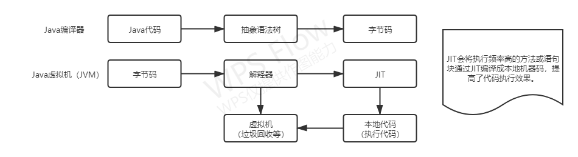
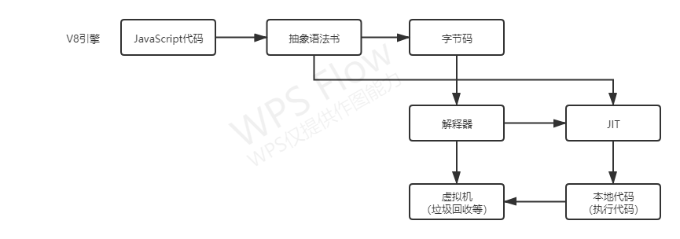

[本系列文字参考地址>>](https://juejin.cn/post/6844904137792962567)

# 一、背景

**V8** 是一个由Google开发的开源 JavaScript 引擎，用于Google Chrome 及 Chromium中，Node底层也使用了V8引擎。据 [Net MARKETSHARE >>](https://netmarketshare.com/)统计，Chrome的市场占有率将近70%，而Node更是前端工程化以及扩展边界的核心支柱，V8引擎对于一个前端开发工程师来说重要程度可想而知。我们大部分 JavaScript 开发者也许没有机会自己开发一个JavaScript引擎，但是学习V8引擎绝对是我们提升技术能力的重要途径，故专门查阅各种书籍和文章进行学习，整理出系列文章让我们一起学习进步。

# 二、什么是V8引擎？

## 1. JavaScript 引擎

了解V8引擎之前我们先要知道什么是JavaScript引擎。简单来说，CPU并不认识我们的JS代码，而不同的CPU只认识自己对应的指令集，JavaScript引擎将JS代码编译成CPU认识的指令集，当然除了编译之外还要负责执行以及内存的管理。 大家都知道JS是解释型语言，由引擎直接读取源码，一边编译一边执行，这样效率相对较低，而编译型语言（如c++）是把源码直接编译成可直接执行的代码，执行效率更高。

>**# 解释型语言**：边解释，边执行
>
>源代码 ↝ 抽象语法树 ↝ 解释器解释和执行
>
>**# 编译型语言**：先编译，再执行
>
>源代码 ↝ 抽象语法树 ↝ 中间表示 ↝ 本地代码

## 2. V8引擎

随着技术的发展，对JavaScript性能的要求越来越高，这就需要更快速的解析和执行JavaScript代码，V8引擎就是在此背景下产生的，它产生的目的就是为了提高性能。 为了提高性能V8向很多同时解释形语言的老前辈学习了很多经验，我们先来看一下同是解释形语言的Java的运行过程。

我们再看一下V8是怎么做的：

整个过程和Java的编译执行过程非常像，将JavaScript代码编译成抽象语法树再转化成字节码，通过解释器来执行，并通过JIT工具将部分字节码转化成可直接执行的本地代码。而Java是分两个阶段完成，在编译阶段尽可能的生成高效的字节码。V8更加直接的将抽象语法树通过JIT技术转换成本地代码，放弃了在字节码阶段可以进行的一些性能优化，但保证了执行速度。虽然少了生成字节码这一阶段的性能优化，但极大减少了转换时间。

# 三、V8编译运行过程

接下来我们来了解一下v8的编译过程和运行过程：

## 1. 编译过程

首先我们要了解一下在执行编译运行过程中所用到的几个类：

- `Script`：表示JavaScript代码，即包含源代码，又包含编译之后生成的本地代码，即是编译入口，又是运行入口；

- `Compiler`：编译器类，辅助Script类来编译生成代码，它主要起一个协调者的作用，会调用解释器（Parser）来生成抽象语法树和全代码生成器，来为抽象语法树生成本地代码；

- `Parser`：将源代码解释并构建成抽象语法树，使用AstNode类来创建它们，并使用Zone类来分配内存；

- `AstNode`：抽象语法树节点类，是其他所有节点的基类，它包含非常多的子类，后面会针对不同的子类生成不同的本地代码；

- `AstVisitor`：抽象语法树的访问者类，主要用来遍历抽象语法树；

- `FullCodeGenerator`：AstVisitor类的子类，通过遍历抽象语法树来为JavaScrit生成本地代码；

