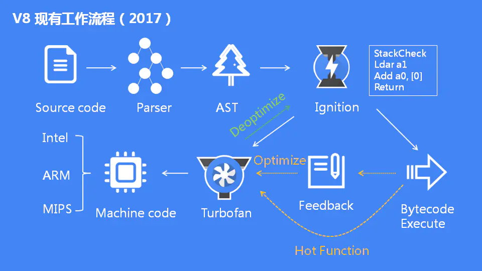

# 一、基础

## 1. 背景

**V8** 是一个由Google开发的开源 `JavaScript` 引擎，用于Google Chrome 及 Chromium 中，Node底层也使用了V8引擎。据 [Net MARKETSHARE >>](https://netmarketshare.com/)统计，Chrome 的市场占有率将近 `70%`，而 Node更 是前端工程化以及扩展边界的核心支柱，V8引擎对于一个前端开发工程师来说重要程度可想而知。

## 2. 什么是V8引擎？

### 2.1. JavaScript 引擎

了解V8引擎之前我们先要知道什么是 `JavaScript` 引擎。简单来说，CPU并不认识我们的 `JS` 代码，而不同的CPU只认识自己对应的指令集，`JavaScript` 引擎将 `JS` 代码编译成CPU认识的指令集，当然除了编译之外还要负责执行以及内存的管理。 大家都知道 `JS` 是解释型语言，由引擎直接读取源码，一边编译一边执行，这样效率相对较低，而编译型语言（如c++）是把源码直接编译成可直接执行的代码，执行效率更高。

>**@解释型语言**：边解释，边执行
>
>源代码 → 抽象语法树 → 解释器解释和执行
>
>**@编译型语言**：先编译，再执行
>
>源代码 → 抽象语法树 → 中间表示 → 本地代码

### 2.2. V8引擎

随着技术的发展，对 `JavaScript` 性能的要求越来越高，这就需要更快速的解析和执行 `JavaScript` 代码，V8引 擎就是在此背景下产生的，它产生的目的就是为了提高性能。 为了提高性能V8向很多同是解释形语言的老前辈学习了很多经验，我们先来看一下同是解释形语言的 `Java` 的运行过程（ `Java` 也是编译型语言）。


[什么是 JIT？ >>](https://blog.csdn.net/qq_36042506/article/details/82976586) （JIT：**J**ust **I**n **T**ime Compiler，即时编译器）

我们再看一下V8是怎么做的：


可以看出，整个过程和 `Java` 的编译执行过程非常像，即将代码编译成抽象语法树再转化成字节码，通过解释器来执行，并通过 `JIT` 工具将部分字节码转化成可直接执行的本地代码。而 `Java`是分两个阶段完成，在编译阶段尽可能的生成高效的字节码。V8更加直接的将抽象语法树通过 `JIT` 技术转换成本地代码，放弃了在字节码阶段可以进行的一些性能优化，但保证了执行速度。虽然少了生成字节码这一阶段的性能优化，但极大减少了转换时间。

## 3. V8编译运行过程

接下来我们来了解一下v8的编译过程和运行过程

### 3.1. 编译过程

首先我们要了解一下在执行编译运行过程中所用到的几个类：

- `Script`：`JavaScript` 代码

- `Compiler`：编译器类，

  辅助Script类来编译生成代码，它主要起一个协调者的作用，会调用解释器（`Parser`）来生成抽象语法树和全代码生成器，来为抽象语法树生成本地代码；

- `Parser`：将源代码解释并构建成抽象语法树，使用 `AstNode` 类来创建它们，并使用 `Zone` 类来分配内存；

- `AstNode`：抽象语法树节点类，是其他所有节点的基类，它包含非常多的子类，后面会针对不同的子类生成不同的本地代码；

- `AstVisitor`：抽象语法树的访问者类，主要用来遍历抽象语法树；

- `FullCodeGenerator：AstVisito` r类的子类，通过遍历抽象语法树来为 `JavaScrit` 生成本地代码；

> 编译过程：源码 → `Parser`（解析生成抽象语法书AST） → AST（生成 `ASTNode` 节点并且分配内存（`Zone`）） → `ASTVisitor`（遍历抽象语法树） → `Generator` 生成代码。

### 3.2. 运行过程

- `Script`
- `Execution`：行代码的辅组类，包含一些重要函数，如 `Call` 函数，它辅组进入和执行Script代码；
- `JSFunction`：需要执行的 `JavaScript` 函数表示类；
- `Runtime`：运行这些本地代码的辅组类，主要提供运行时所需的辅组函数，如：属性访问、类型转换、编译、算术、位操作、比较、正则表达式等；
- `Heap`：运行本地代码需要使用的内存堆类；
- `MarkCompactCollector`：垃圾回收机制的主要实现类，用来标记、清除和整理等基本的垃圾回收过程；
- `SweeperThread`：负责垃圾回收的线程。


# 二、AST

关于AST的相关知识点请 [参考这里 >>](https://gitee.com/lihongyao/Blogs/blob/master/007.%20Babel%20&%20Ast.md)

# 三、从字节码看V8的演变

## 1. 字节码概念

### 1.1. 什么是字节码？

> 引用 [维基百科 >>](https://zh.wikipedia.org/wiki/%E5%AD%97%E8%8A%82%E7%A0%81) 介绍：

> 字节码（英语：Bytecode）通常指的是已经经过编译，但与特定机器代码无关，需要解释器转译后才能成为机器代码的 **中间代码**。字节码通常不像源码一样可以让人阅读，而是编码后的数值常量、引用、指令等构成的序列。

按照作者的对字节码的理解大概是这样：

计算机只能识别二进制代码，而二进制代码（指令集）是不合适人类书写和阅读的，不同的CPU架构对应的指令集也是完全不同的，为了克服这个问题，大神们就创造出了适合人类的语言，也就是所谓的 “高级” 语言，这些高级语言与人类的自然语言以及数学公式的使用是非常接近的，而且不用考虑CPU架构差异。而高级语言和二进制代码之间的差异是相当大的，直接转换会非常麻烦，这时就有了二者中间的代码——**字节码**。

### 1.2. 字节码的优点

要了解字节码的优点，最直观的方式就是直接看字节码给 `Java` 带来了什么，早期 `Java` 推广的口号就是 Compile Once，Run anywhere（一次编译到处运行），`Java` 源代码经过编译程序编译之后生成扩展名为 `.class` 的字节码文件。再通过 `JVM` 将字节码翻译为机器的计算机指令（目标机器必须要安装对应的`JVM`（ `Java` 虚拟机））。
`Java` 语言使用字节码的方式，一定程度的解决了解释性语言执行效率低的问题，同时由于字节码不针对一种特定的机器，所以 `Java` 程序无须重新编译就可在多种不同的计算机上运行。

字节码的优点总结来说就是：

- 不针对特定CPU架构；
- 比原始的高级语言转换成机器语言更快；

## 2. V8的演变

### 2.1. 早期架构

V8未诞生之前，早期最主流的 `JavaScript` 引擎是 `JavaScriptCore` 引擎。`JavasSriptCore` 是通过生成字节码再将字节码转化成二进制代码的方式运行的，而V8诞生的使命就是性能的极致，Google觉得这种架构生成字节码会浪费时间，V8早期采用了直接生成机器码的方式如下图：


我们一起来看一下V8早期架构如何执行js代码的：

- 第一步，将js源代码转化成AST（抽象语法树）

- 第二步，通过Full-Codegen引擎编译AST变成二进制文件，然后直接执行这些二进制文件。

- 第三步，在执行二进制代码的过程中，标记重复执行的函数，将标记的代码通过Crankshaft引擎进行优化编译生成效率更高的二进制代码，再次运行到这个函数时使用效率更高的二进制代码。

同时采用了将二进制代码缓存（缓存到内存和硬盘上）的策略来省去重复编译的时间，在初期这种架构的确带来了速度上的改善。将js源码转化成的二进制代码占用的内存空间是非常巨大的，如果说一个js源码的文件大小是1M，那么生成的二进制代码可能就是十几M，而早期手机的内存普遍不高，过度占用会导致性能大大降低。

### 2.2. 为什么要引入字节码？

随着网页的复杂化以及移动端的流行，早期的架构也带来非常多的问题

> **1）内存占用问题**

最核心的问题就是内存占用问题，在V8执行的过程会将js源代码转化成二进制代码并且将二进制代码存储到内存中，退出进程后会将二进制代码存储到硬盘上。

> **2）代码复杂度高**

上文提到过不同的CPU架构对应的指令集是完全不同的，而市面上CPU架构的种类又非常多，那么将AST转化为二进制代码的Full-Codegen引擎以及优化编译的Crankshaft引擎要针对不同的CPU架构编写代码，这个复杂程度及工作量可想而知，而对字节码进行编译可以大大的减少这个工作量

> **3）一个Bug**

我们先来看一下这个 [Bug >>](https://bugs.chromium.org/p/chromium/issues/detail?id=593477)，大概描述是这样的：

Bug的报告人在当时的Chrome浏览器下重复加载Facebook，并打开了各项监控发现：第一次加载时 v8.CompileScript 花费了 165 ms，而重复加载时发现真正耗时高的js代码并没有被缓存，导致重复加载时编译的时间和第一次加载的消耗大致相同。

导致这个问题的原因其实也很好理解，之前提到过因为二进制代码占用内存空间大，根据惰性编译的优化原则，所以V8并不会将所有代码进行编译只会编译最外层的代码，而在函数内部的代码会在第一次调用时编译，比如：


如果浏览器只缓存最外层代码，那么对我们前端高度工程化的模块来说会导致里面的关键代码却无法被缓存，这也是导致上述bug的主要原因。

### 2.3. 现有架构

为了解决上述的问题，V8开始采用引入字节码的架构，最终采用了如下图的架构：



我们来一起看一下V8现有架构是如何执行js代码的：

- 第一步，将js源代码转化成AST（抽象语法树）。
- 第二步，通过Ignition解释器将AST编译成字节码，开始逐句对字节码进行解释成二进制代码并执行。
- 第三步，在解释执行的过程中，标记重复执行的热点代码，将标记的代码通过Turbofan引擎进行编译生成效率更高二进制代码，再次运行到这个函数时便只执行高效代码而不再解释执行字节码。

V8引入了字节码的架构模式后明显的解决了如下问题：

- 启动时间较长：启动时只需要编译出字节码，然后逐句执行字节码，编译出字节码的速度可远远快于编译出二进制代码的速度。
- 内存占用较大：字节码的空间占用也是远远低于二进制代码的空间占用。
- 代码复杂度太高：大大降低了V8适应不同CPU所需要的代码复杂程度。

最后我们再来看一下新架构和原有架构比较带来的效果：

- 内存占用：

  

- 网页速度：

  

# 四、字节码是如何执行的？

简单来说V8引擎通常会经过以下流程：`源码` → `AST` → `字节码` → `二进制代码`

源码通过 Parse 转成AST的过程可以 [参考这里 >>](https://gitee.com/lihongyao/Blogs/blob/master/007.%20Babel%20&%20Ast.md)，接下来会通过 v8 `BytecodeGenerator` 类根据抽象语法树将AST结构转换成字节码的结构，字节码是机器码的抽象，而 `Ignition` 引擎对生成的字节码进行解释执行。

## 1. 基于寄存器

`Ignition`引擎可以对字节码进行解释执行，也就是说他的功能类似于 `Java` 的 `JVM`，本质上就是一个虚拟机。 虚拟机通常有两种分别是基于Stack（栈）的和基于Register（寄存器）的， 比如基于Stack的虚拟机有 `JVM`，是一种比较广泛的实现方法，而我们V8引擎中的 `Ignition` 是基于 `Register` 的，也就是基于寄存器的虚拟机，通常基于Register的虚拟机比基于Stack的虚拟机执行的更快，但是指令相对较长。

`Ignition` 是一个带有累加器（accumulator）的寄存器，我举一个小例子大家就明白了。 我们先抛开字节码看这段简单的代码如何计算出结果。

```javascript
var x = 100;
var y = x + 10;
x = x * y;
```

运用累加寄存器的大致运行流程如下：


这种就是我们基于寄存器虚拟机运行的一个大致流程，简单来说就是创建一块虚拟空间来保存参数、中间计算结果。

## 2. 通过官方案例解读字节码

接下来会通过 [Google官方PPT >>](https://docs.google.com/presentation/d/1HgDDXBYqCJNasBKBDf9szap1j4q4wnSHhOYpaNy5mHU/edit#slide=id.g1357e6d1a4_0_58) 上面的一段案例来解读V8上字节码的执行。我会逐图配上一些文字注解帮助大家阅读。

- 先将源码转换成字节码：

  

- 进行函数 **f** 的初始化工作：

  

> Tips：随着v8版本的更新，不同的版本生成的字节码结构可能有细微差别，但是这些定义好的函数一般不会有太大变化

通过这个例子相信大家可以大概了解字节码的执行，但是v8定义的关键字可不止例子中这一点（完整的放在附录中了），在学习的过程中开始很多关键字也确实不好理解，不过我们可以通过自己写一些简单的js代码然后生成字节码，因为我们已知js的执行结果，可以通过倒推的方式来理解字节码。

# 十、参考文章

- https://juejin.cn/post/6844904137792962567

