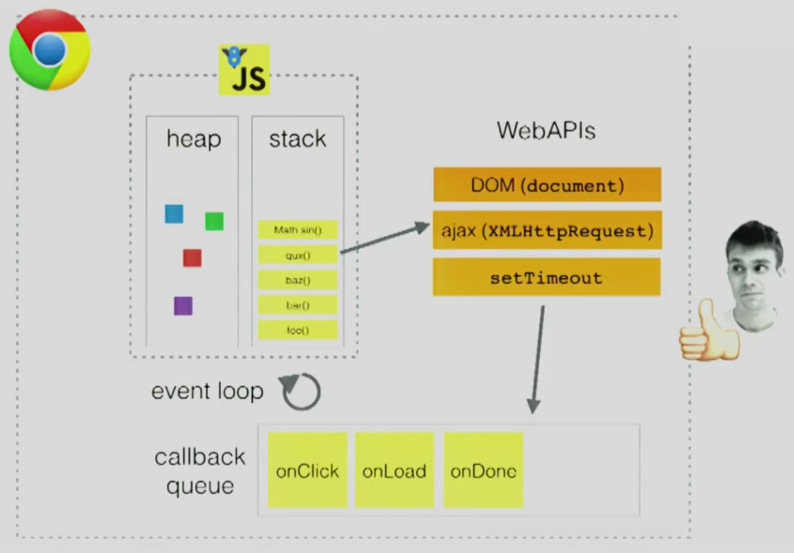

# 一、基础

## 1. 背景

**V8** 是一个由Google开发的开源 `JavaScript` 引擎，用于Google Chrome 及 Chromium 中，Node底层也使用了V8引擎。据 [Net MARKETSHARE >>](https://netmarketshare.com/)统计，Chrome 的市场占有率将近 `70%`，而 Node更 是前端工程化以及扩展边界的核心支柱，V8引擎对于一个前端开发工程师来说重要程度可想而知。

## 2. 什么是V8引擎？

### 2.1. JavaScript 引擎

了解V8引擎之前我们先要知道什么是 `JavaScript` 引擎。简单来说，CPU并不认识我们的 `JS` 代码，而不同的CPU只认识自己对应的指令集，`JavaScript` 引擎将 `JS` 代码编译成CPU认识的指令集，当然除了编译之外还要负责执行以及内存的管理。 大家都知道 `JS` 是解释型语言，由引擎直接读取源码，一边编译一边执行，这样效率相对较低，而编译型语言（如c++）是把源码直接编译成可直接执行的代码，执行效率更高。

>**@解释型语言**：边解释，边执行
>
>源代码 → 抽象语法树 → 解释器解释和执行
>
>**@编译型语言**：先编译，再执行
>
>源代码 → 抽象语法树 → 中间表示 → 本地代码

### 2.2. V8引擎

随着技术的发展，对 `JavaScript` 性能的要求越来越高，这就需要更快速的解析和执行 `JavaScript` 代码，V8引 擎就是在此背景下产生的，它产生的目的就是为了提高性能。 为了提高性能V8向很多同是解释形语言的老前辈学习了很多经验，我们先来看一下同是解释形语言的 `Java` 的运行过程（ `Java` 也是编译型语言）。


[什么是 JIT？ >>](https://blog.csdn.net/qq_36042506/article/details/82976586) （JIT：**J**ust **I**n **T**ime Compiler，即时编译器）

我们再看一下V8是怎么做的：


可以看出，整个过程和 `Java` 的编译执行过程非常像，即将代码编译成抽象语法树再转化成字节码，通过解释器来执行，并通过 `JIT` 工具将部分字节码转化成可直接执行的本地代码。而 `Java`是分两个阶段完成，在编译阶段尽可能的生成高效的字节码。V8更加直接的将抽象语法树通过 `JIT` 技术转换成本地代码，放弃了在字节码阶段可以进行的一些性能优化，但保证了执行速度。虽然少了生成字节码这一阶段的性能优化，但极大减少了转换时间。

## 3. V8编译运行过程

接下来我们来了解一下v8的编译过程和运行过程

### 3.1. 编译过程

首先我们要了解一下在执行编译运行过程中所用到的几个类：

- `Script`：`JavaScript` 代码

- `Compiler`：编译器类，

  辅助Script类来编译生成代码，它主要起一个协调者的作用，会调用解释器（`Parser`）来生成抽象语法树和全代码生成器，来为抽象语法树生成本地代码；

- `Parser`：将源代码解释并构建成抽象语法树，使用 `AstNode` 类来创建它们，并使用 `Zone` 类来分配内存；

- `AstNode`：抽象语法树节点类，是其他所有节点的基类，它包含非常多的子类，后面会针对不同的子类生成不同的本地代码；

- `AstVisitor`：抽象语法树的访问者类，主要用来遍历抽象语法树；

- `FullCodeGenerator：AstVisito` r类的子类，通过遍历抽象语法树来为 `JavaScrit` 生成本地代码；

> 编译过程：源码 → `Parser`（解析生成抽象语法书AST） → AST（生成 `ASTNode` 节点并且分配内存（`Zone`）） → `ASTVisitor`（遍历抽象语法树） → `Generator` 生成代码。

### 3.2. 运行过程

- `Script`
- `Execution`：行代码的辅组类，包含一些重要函数，如 `Call` 函数，它辅组进入和执行Script代码；
- `JSFunction`：需要执行的 `JavaScript` 函数表示类；
- `Runtime`：运行这些本地代码的辅组类，主要提供运行时所需的辅组函数，如：属性访问、类型转换、编译、算术、位操作、比较、正则表达式等；
- `Heap`：运行本地代码需要使用的内存堆类；
- `MarkCompactCollector`：垃圾回收机制的主要实现类，用来标记、清除和整理等基本的垃圾回收过程；
- `SweeperThread`：负责垃圾回收的线程。


# 二、AST

关于AST的相关知识点请 [参考这里 >>](https://gitee.com/lihongyao/Blogs/blob/master/007.%20Babel%20&%20Ast.md)

# 三、从字节码看V8的演变

## 1. 字节码概念

### 1.1. 什么是字节码？

> 引用 [维基百科 >>](https://zh.wikipedia.org/wiki/%E5%AD%97%E8%8A%82%E7%A0%81) 介绍：

> 字节码（英语：Bytecode）通常指的是已经经过编译，但与特定机器代码无关，需要解释器转译后才能成为机器代码的 **中间代码**。字节码通常不像源码一样可以让人阅读，而是编码后的数值常量、引用、指令等构成的序列。

按照作者的对字节码的理解大概是这样：

计算机只能识别二进制代码，而二进制代码（指令集）是不合适人类书写和阅读的，不同的CPU架构对应的指令集也是完全不同的，为了克服这个问题，大神们就创造出了适合人类的语言，也就是所谓的 “高级” 语言，这些高级语言与人类的自然语言以及数学公式的使用是非常接近的，而且不用考虑CPU架构差异。而高级语言和二进制代码之间的差异是相当大的，直接转换会非常麻烦，这时就有了二者中间的代码——**字节码**。

### 1.2. 字节码的优点

要了解字节码的优点，最直观的方式就是直接看字节码给 `Java` 带来了什么，早期 `Java` 推广的口号就是 Compile Once，Run anywhere（一次编译到处运行），`Java` 源代码经过编译程序编译之后生成扩展名为 `.class` 的字节码文件。再通过 `JVM` 将字节码翻译为机器的计算机指令（目标机器必须要安装对应的`JVM`（ `Java` 虚拟机））。
`Java` 语言使用字节码的方式，一定程度的解决了解释性语言执行效率低的问题，同时由于字节码不针对一种特定的机器，所以 `Java` 程序无须重新编译就可在多种不同的计算机上运行。

字节码的优点总结来说就是：

- 不针对特定CPU架构；
- 比原始的高级语言转换成机器语言更快；

## 2. V8的演变

### 2.1. 早期架构

V8未诞生之前，早期最主流的 `JavaScript` 引擎是 `JavaScriptCore` 引擎。`JavasSriptCore` 是通过生成字节码再将字节码转化成二进制代码的方式运行的，而V8诞生的使命就是性能的极致，Google觉得这种架构生成字节码会浪费时间，V8早期采用了直接生成机器码的方式如下图：


我们一起来看一下V8早期架构如何执行js代码的：

- 第一步，将js源代码转化成AST（抽象语法树）

- 第二步，通过Full-Codegen引擎编译AST变成二进制文件，然后直接执行这些二进制文件。

- 第三步，在执行二进制代码的过程中，标记重复执行的函数，将标记的代码通过Crankshaft引擎进行优化编译生成效率更高的二进制代码，再次运行到这个函数时使用效率更高的二进制代码。

同时采用了将二进制代码缓存（缓存到内存和硬盘上）的策略来省去重复编译的时间，在初期这种架构的确带来了速度上的改善。将js源码转化成的二进制代码占用的内存空间是非常巨大的，如果说一个js源码的文件大小是1M，那么生成的二进制代码可能就是十几M，而早期手机的内存普遍不高，过度占用会导致性能大大降低。

### 2.2. 为什么要引入字节码？

随着网页的复杂化以及移动端的流行，早期的架构也带来非常多的问题

> **1）内存占用问题**

最核心的问题就是内存占用问题，在V8执行的过程会将js源代码转化成二进制代码并且将二进制代码存储到内存中，退出进程后会将二进制代码存储到硬盘上。

> **2）代码复杂度高**

上文提到过不同的CPU架构对应的指令集是完全不同的，而市面上CPU架构的种类又非常多，那么将AST转化为二进制代码的Full-Codegen引擎以及优化编译的Crankshaft引擎要针对不同的CPU架构编写代码，这个复杂程度及工作量可想而知，而对字节码进行编译可以大大的减少这个工作量

> **3）一个Bug**

我们先来看一下这个 [Bug >>](https://bugs.chromium.org/p/chromium/issues/detail?id=593477)，大概描述是这样的：

Bug的报告人在当时的Chrome浏览器下重复加载Facebook，并打开了各项监控发现：第一次加载时 v8.CompileScript 花费了 165 ms，而重复加载时发现真正耗时高的js代码并没有被缓存，导致重复加载时编译的时间和第一次加载的消耗大致相同。

导致这个问题的原因其实也很好理解，之前提到过因为二进制代码占用内存空间大，根据惰性编译的优化原则，所以V8并不会将所有代码进行编译只会编译最外层的代码，而在函数内部的代码会在第一次调用时编译，比如：


如果浏览器只缓存最外层代码，那么对我们前端高度工程化的模块来说会导致里面的关键代码却无法被缓存，这也是导致上述bug的主要原因。

### 2.3. 现有架构

为了解决上述的问题，V8开始采用引入字节码的架构，最终采用了如下图的架构：


我们来一起看一下V8现有架构是如何执行js代码的：

- 第一步，将js源代码转化成AST（抽象语法树）。
- 第二步，通过Ignition解释器将AST编译成字节码，开始逐句对字节码进行解释成二进制代码并执行。
- 第三步，在解释执行的过程中，标记重复执行的热点代码，将标记的代码通过Turbofan引擎进行编译生成效率更高二进制代码，再次运行到这个函数时便只执行高效代码而不再解释执行字节码。

V8引入了字节码的架构模式后明显的解决了如下问题：

- 启动时间较长：启动时只需要编译出字节码，然后逐句执行字节码，编译出字节码的速度可远远快于编译出二进制代码的速度。
- 内存占用较大：字节码的空间占用也是远远低于二进制代码的空间占用。
- 代码复杂度太高：大大降低了V8适应不同CPU所需要的代码复杂程度。

最后我们再来看一下新架构和原有架构比较带来的效果：

- 内存占用：

  

- 网页速度：

  

# 四、字节码是如何执行的？

简单来说V8引擎通常会经过以下流程：`源码` → `AST` → `字节码` → `二进制代码`

源码通过 Parse 转成AST的过程可以 [参考这里 >>](https://gitee.com/lihongyao/Blogs/blob/master/007.%20Babel%20&%20Ast.md)，接下来会通过 v8 `BytecodeGenerator` 类根据抽象语法树将AST结构转换成字节码的结构，字节码是机器码的抽象，而 `Ignition` 引擎对生成的字节码进行解释执行。

## 1. 基于寄存器

`Ignition`引擎可以对字节码进行解释执行，也就是说他的功能类似于 `Java` 的 `JVM`，本质上就是一个虚拟机。 虚拟机通常有两种分别是基于Stack（栈）的和基于Register（寄存器）的， 比如基于Stack的虚拟机有 `JVM`，是一种比较广泛的实现方法，而我们V8引擎中的 `Ignition` 是基于 `Register` 的，也就是基于寄存器的虚拟机，通常基于Register的虚拟机比基于Stack的虚拟机执行的更快，但是指令相对较长。

`Ignition` 是一个带有累加器（accumulator）的寄存器，我举一个小例子大家就明白了。 我们先抛开字节码看这段简单的代码如何计算出结果。

```javascript
var x = 100;
var y = x + 10;
x = x * y;
```

运用累加寄存器的大致运行流程如下：


这种就是我们基于寄存器虚拟机运行的一个大致流程，简单来说就是创建一块虚拟空间来保存参数、中间计算结果。

## 2. 通过官方案例解读字节码

接下来会通过 [Google官方PPT >>](https://docs.google.com/presentation/d/1HgDDXBYqCJNasBKBDf9szap1j4q4wnSHhOYpaNy5mHU/edit#slide=id.g1357e6d1a4_0_58) 上面的一段案例来解读V8上字节码的执行。我会逐图配上一些文字注解帮助大家阅读。

- 先将源码转换成字节码：

  

- 进行函数 **f** 的初始化工作：

  

> Tips：随着v8版本的更新，不同的版本生成的字节码结构可能有细微差别，但是这些定义好的函数一般不会有太大变化

通过这个例子相信大家可以大概了解字节码的执行，但是v8定义的关键字可不止例子中这一点（完整的放在附录中了），在学习的过程中开始很多关键字也确实不好理解，不过我们可以通过自己写一些简单的js代码然后生成字节码，因为我们已知js的执行结果，可以通过倒推的方式来理解字节码。

# 六、内存结构

## 1. 什么是内存？

计算机由5个部分组成：控制器、运算器、**存储器**、输入设备、输出设备。

我们说的内存通常属于存储器，程序运行时CPU需要调用的指令和数据只能通过内存获取（硬盘只有存储功能，执行时会将数据缓存到内存中），所以不管是什么语言的程序，运行时都依赖内存，而内存生命周期基本都是一致的：

1）分配内存

2）使用内存（读取操作）

3）释放内存

很多文章讲 `JavaScript` 的内存如何如何，事实上，我认为这种说法是不准确的，本身 `JavaScript` 只是一种语言，真正进行内存调用分配的是 `JavaScript` 依赖的引擎。

## 2. 简述堆和栈

### 2.1. 为什么是堆和栈？

在V8引擎中，可以先粗犷的分为两个部分 **栈** 和 **堆**。

那栈指的就是 <u>调用栈</u>，首先栈的特点后进先出，同时栈空间是连续的，在需要分配空间和销毁空间操作时，只需要移动下指针，所以非常适合管理函数调用。

而正因为栈空间是连续的，那它的空间就注定是非常有限的，所以不方便存放大的数据，这时我们就使用了 <u>内存堆</u> 来管理保存一些大数据。

### 2.2. 基础类型和引用类型

在 `js` 中，数据类型大致可以分为以下两类：

- 基础数据类型：`undefined`，`null`，`Number`，`String`，`Boolean`，`Symbol`
- 引用数据类型：`Object`，`Array`，`Function`

> 提示：
>
> 1）实际上，`js` 中的 `Array` 和 `Function` 都是基于 `Object` 的，我们可以理解引用类型指的就是 `Object`；
>
> 2）这里可能有人会说 `null` 不应该是空指针对象类型吗，ty`peof null === 'Object'` 应该算是对象，事实上这里是一个设计上的历史遗留问题，而对V8系统来说无论是 `null`  还是 `Undefined` 都只是一个存在于栈里的固定值。

因为基础类型的值通常是简单的数据段，占用固定大小的空间，所以会存储在 **栈** 中，而对象大小不定且通常会占用较大空间所以会存储在 **堆** 中，而在栈空间会保存对象存储在堆空间的地址。

我们将一段代码通过一张图来简单看一下：

```javascript
var a = 123;
var b = 'abc';
var c = {x: 1};
var d = 123;
var f = c;
var g = {x: 1};
```


基础类型的值在创建时会开辟一块内存空间，将内存地址存储在对应的变量上，如果此时再创建一个基础类型等同于之前创建过的值，会直接将地址存储在新创建的变量上，所以就会有 `a === d` 。

那么如果创建一个对象，就会在堆中开辟一块空间用来存储对象，将内存地址存储在对应的变量上，如果此时创建一个新的变量（f）赋值为之前所创建的存储对象地址的变量（c），那么会将c存储的堆内存地址赋值给f，就会有 `c === f`。

如果此时再创建一个新的对象变量（g），就会在堆中再开辟一块空间来创建对象，将地址赋予（g），但是即使对象内容一样，地址不同指向的也是两块空间，就会有 `g !== c`。

关于函数调用也很好理解，也是用一段代码一张图来表示如下：

```javascript
function main() {
    func1();
}
function func1() {
    func2();
    func3();
};
function func2() {};
function func3() {};
main();
```


在函数间的嵌套调用的过程中外层的函数不会释放，而栈的空间是有限的也有着严格的数量限制，所以在使用递归的时候要注意是否会 **溢出**。

## 3. V8 内存管理的核心 — 堆

栈的管理通常比较容易一点，通过上下移动指针来管理即可，而堆的管理相对复杂很多，我们通常说的垃圾回收等也主要针对堆来说的。

### 3.1. 堆空间的结构

我们先来看一下内存的结构组成：


V8引擎初始化内存空间主要将堆内存分为以下几个区域：

- 新生代内存区（`new space`）

  新生代内存区会被划分为两个 `semispace`，每个 `semispace` 大小默认为 16MB，也就是说新生代内存区通常只有 32MB 大小（64位），而这两个semispace分别是 `from-space` 和 `to-space`（具体有什么用下文会说），通常新创建的对象会先放入这两个 `semispace` 中的一个。

- 老生代内存区（`old space`）
  
  通常会较为持久的保存对象，也分为两个区域 `old pointer space` 和 `old data space` 分别用来存放GC后还存活的指针信息和数据信息。
  
- 大对象区（`large object space`）

  这里存放体积超越其他区大小的对象，主要为了避免大对象的拷贝，使用该空间专门存储大对象。

- 单元区、属性单元区、Map区（`Cell space`、`property cell space`、`map space`）
  
  Map空间存放对象的Map信息也就是 [隐藏类(Hiden Class）](https://time.geekbang.org/column/article/226417) 最大限制为8MB；每个Map对象固定大小，为了快速定位，所以将该空间单独出来。
  
- 代码区 (`code Space`)
   
   主要存放代码对象，最大限制为512MB，也是唯一拥有执行权限的内存。

### 3.2. 内存运行的生命周期

堆内存空间分成了有不同功能作用的空间区域，大对象区，map区，代码区没什么好说的，重点还是了解一下 **新生代内存区** 和 **老生代内存区**。

这里我们假设创建了一个对象 `obj`，先说一下**新生代内存区**的两个space也就是 `from-space` 和 `to-space` 的作用：

- 首先 `obj` 会被分配到 **新生代** 中两个 space 中的其中一个space，这里我们假设分配到了 from-space 中。
- 程序继续执行会不断的向 from-space 中添加新的对象信息，这时 from-space 将要达到了存储的上限（16MB），V8的垃圾回收机制会开始清理from中不再被使用的对象（即没有被指向的对象）。
- 清理后，将所有仍然存活的对象（我们假设 `obj` 还存活），会被复制到 to-space，然后删除所有from-space中的对象。
- 这时，程序继续运行，如果有新创建的对象会不断的分配到 to-space中，当 to-space快要满了重复执行上面说的复制转移的工作。

也就是说创建的对象会在to-space 和 from-space 之间转移，也就是所谓的 to → from, from → to 的角色互换过程。

接下来说一下**老生代内存区**，现在继续看上文说的那个对象 `obj`：

- 经过程序一段时间运行后的 `obj` 依然存活在新生代内存区，终于满足了晋升的条件，便转移到了老生代内存区。
- 又过了一段时间对象 `obj` 终于不被引用了，同时老生代内存区域空间也被占用了很多的空间，V8就会在老生代里面进行遍历，发现了对象 `obj` 已经不被引用了，于是给他打了个标记。
- 由于V8是单线程的执行机制，V8为了避免一次清除占用太多时间，会给这批打了标记的待清理对象进行分批回收，至此这个对象就在内存中释放掉了。

# 七、垃圾回收机制

## 1. 垃圾回收

我们先简单了解一下垃圾回收的概念，比如 `JavaScript` 代码运行时，需要分配内存空间来储存变量和值，当变量不再参与运行时，就需要销毁它们回收内存，这一过程就是垃圾回收。

垃圾回收的过程是v8引擎自动帮我们执行的，在绝大部分情况下v8都能很好的完成这个过程，但是作为一段程序，能帮我们cover住的情况是有限的，所以一旦我们代码不够严谨，就会引发内存泄露。

## 2. 垃圾回收器

**代际假说**（The Generational Hypothesis）是垃圾回收领域中的一个重要术语， V8的垃圾回收的策略也是建立在该假说的基础之上。

代际假说也很简单，主要有两个特点：

1）大部分对象在内存中存在的时间很短（简单来说，就是很多对象一经分配内存，很快就变得不可访问）。

2）不死的对象，会活的更久。

基于这个这个假说 V8 才会把堆分为新生代和老生代两个区域，同时设计了两个垃圾回收器：

- 副垃圾回收器：负责新生代区域的垃圾回收
- 主垃圾回收器：负责老生代区域的垃圾回收

### 2.1. 副垃圾回收器（Scavenging）

副垃圾回收器主要用来回收新生代的垃圾，通常我们新创建的对象都会先分配到新生代内存区中。

新生代内存区会分成两个部分（space），from-space 和 to-space ，这两个区域本质都是一样的，都拥有两个状态：工作状态 和 空闲状态，并且当一个为工作状态的时候另一个一定是空闲状态。


比如我们新创建一个对象：

- 会向内存堆中的新生代去分配，假如此时新生代中的from spcae 是工作状态，那么对象会分配到from-space 中。
- 经过一段时间程序运行，from-space 的内存即将达到存储的上限。
- V8引擎此时执行一次垃圾清理操作，会将 from-space中不再使用的对象（根节点无法遍历到的对象）进行标记。
- 会将未被标记的对象进行复制，复制到空闲状态的to-space中并且有序的重新排列起来，再将from-space进行清空操作，同时将from-space 标记为空闲状态，将to-space标记为工作状态。

以上就是所谓的置换也可以说是翻转过程，因为这种复制操作需要时间成本，所以新生代的空间往往并不大，执行的也较为频繁。

随着程序的运行，某些对象一直在被使用会持续的积压在新生代区域，为了解决这个问题，V8采用了 晋升机制 将满足条件的对象放到老生代内存区中存储，释放新生代内存区域的空间。

晋升机制的条件：

- 对象是否经历过一次 `Scavenge` 算法且未被标记清除；
- 被复制的对象大于 `to-space`  空间的 `25%`；

晋升后的对象分配到老生代内存区，便由老生代内存区来管理。

### 2.2. 主垃圾回收器(Mark-Sweep & Mark-Compact)

主垃圾回收器主要用来回收老生代的垃圾，通常会有在新生代晋升后的对象以及初始占用空间就很大的对象会存储在老生代内存区。

主垃圾回收器采用的方法和副垃圾回收器的方法完全不同，主垃圾回收器会先使用 `标记 - 清除（Mark-Sweep）`的算法进行垃圾回收。

引用一下李兵老师的描述：

> **首先是标记过程阶段**。标记阶段就是从一组根元素开始，递归遍历这组根元素，在这个遍历过程中，能到达的元素称为活动对象，没有到达的元素就可以判断为垃圾数据。

> **接下来就是垃圾的清除过程**。它和副垃圾回收器的垃圾清除过程完全不同，主垃圾回收器会直接将标记为垃圾的数据清理掉。


整个标记 - 清除（Mark-Sweep）的过程相当于清理上图中红色部分区域的过程。

但是我们通过这种标记清除的方式进行内存清理会产生大量不连续的内存碎片，当我们想要存储一个大的对象的时候就可能没有足够的空间，那么除了执行 标记 - 清除（Mark-Sweep） 算法外，还通过 标记 - 整理（Mark-Compact） 算法进行垃圾回收。

标记 - 整理（Mark-Compact） 算法主要也是分两步：

- 首先同样是标记过程。
- 将未标记的对象（存活对象）进行左移，移动完成后清理边界外的内存。

V8通过标记 - 清除（Mark-Sweep） 以及 标记 - 整理（Mark-Compact） 两种算法对老生代内存区进行垃圾回收，这就是主垃圾回收器的主要工作。

## 3. 如何避免内存泄漏？

- 尽可能少地创建全局变量；
- 手动清除定时器；
- 少用闭包；
- 清除DOM引用；
- 弱引用（`WeakMap`，`WeakSet`）

# 八、消息队列

## 1. 单线程

### 1.1. 为什么是单线程？

由于 `JavaScript` 最初作为浏览器脚本语言，主要用来与用户互动、操作dom等，如果有多个线程同时操作一个DOM的情况，会导致非常难以处理，所以 `JavaScript` 只能设计成单线程。

不过现代计算机基本都是多核CPU的，纯粹的单线程会导致一些性能得不到释放，所以新的 HTML5 标准中提出了 web worker 概念，允许用户额外开启线程，不过 worker 线程是完全受主线程控制（大部分情况处理一些计算逻辑），且没有操作DOM的权限，本质上 `JavaScript` 还是单线程。

### 1.2. 异步任务

`JavaScript` 只有一个主线程用来执行任务，但是同一时间只能执行一个任务也就是函数，普通的函数会形成一个任务队列排队执行，但是有些任务会非常耗时且不可控（网络请求、事件监听）等，如果让这些任务也和普通任务一样排队执行，那么执行效率低不说还会导致页面的卡死。于是就有了异步任务，而 V8 引擎 通过消息队列 和 事件循环 系统让异步任务执行且不用排队等待执行完毕。

## 2. 消息队列

消息队列是 V8引擎 除了主线程任务外，额外维护的一个队列，主要存放要执行的任务（函数）。完全符合队列 先进先出 的特点，从队列的头部取出任务，从队列的尾部添加任务。

浏览器本身需要异步的场景非常多，而每一种异步操作的机制也各不相同， 消息队列可以和多种异步场景产生交互。

- 输入事件相关的异步交互（比如 `onClick`）由引擎的 `DOM Binding` 模块处理，相应的事件触发时，会将对应的回调函数添加到消息队列中。 
- `ajax` 请求相关的异步交互 由引擎的 `network` 模块处理，在网络请求完成返回之后，会将对应的回调函数添加到消息队列中。 
- 定时器相关的异步交互 由引擎的 `timer` 模块处理，当时间到达的时候，会将回调函数添加到任务队列中。（定时器调度策略比较复杂，会有专门的调度策略在合适的时间添加对应的回调任务）

以及一些其他的模块会将异步操作放置到消息队列中，在引擎主线程的任务都执行完成后再执行消息队列中被推送的任务。

具体如下图：



图片来源：[《Help, I'm stuck in an event-loop》](https://vimeo.com/96425312)

那么消息队列会在什么时候执行呢？

每次执行栈中的代码就是一个宏任务，而消息队列中的任务会按顺序放到下一次的宏任务中，每个宏任务在执行时，V8 都会重新创建栈，然后随着宏任务中函数调用，栈也随之变化，最终，当该宏任务执行结束时，整个栈又会被清空，接着主线程继续执行下一个宏任务。

而浏览器会在一个宏任务执行结束后，在下一个 task 执行开始前，对页面进行重新渲染如图：


由于主线程执行消息队列中宏任务的时间颗粒度太粗了（主要中间有一次渲染过程），无法胜任一些对精度和实时性要求较高的场景，所以又引入了promise 机制也就是微任务如图:


> **Tips：**
>
> 本篇的重点不在于宏任务和微任务，所以简单带过，但是我想表达的是，现在前端面试大概率都会问到宏任务和微任务，很多人都只会回答到宏任务和微任务的执行顺序，但是如果你回答出中间还有一个页面渲染的过程，才算真正了解。

## 3. 事件循环

如果你能理解上文的消息队列机制，那么事件循环就很好理解了，本质上就是：

- 主线程运行产生了执行栈，在调用执行栈的过程中调用了一些异步函数。

- 当满足异步函数的触发条件时，会将对应的回调函数推送到消息队列中。

- 当主栈中的代码执行完毕时，会触发一次页面渲染，然后创建新的主栈。

- 将消息队列中的回调函数推送到主栈。然后顺序执行主栈的任务。

- 反复循环执行上述过程就是时间循环。

# 九、协成 & 生成器函数


# 十、参考文章

- https://juejin.cn/post/6844904137792962567

